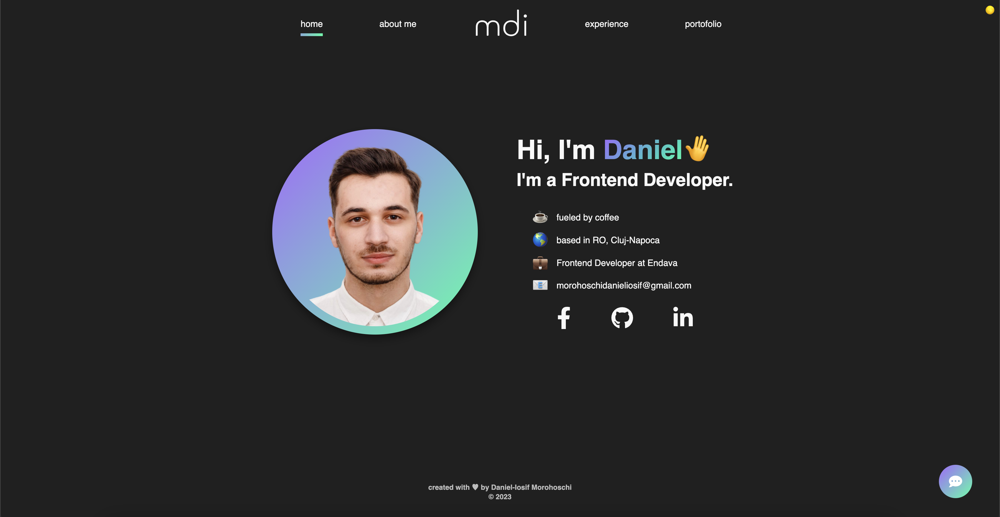
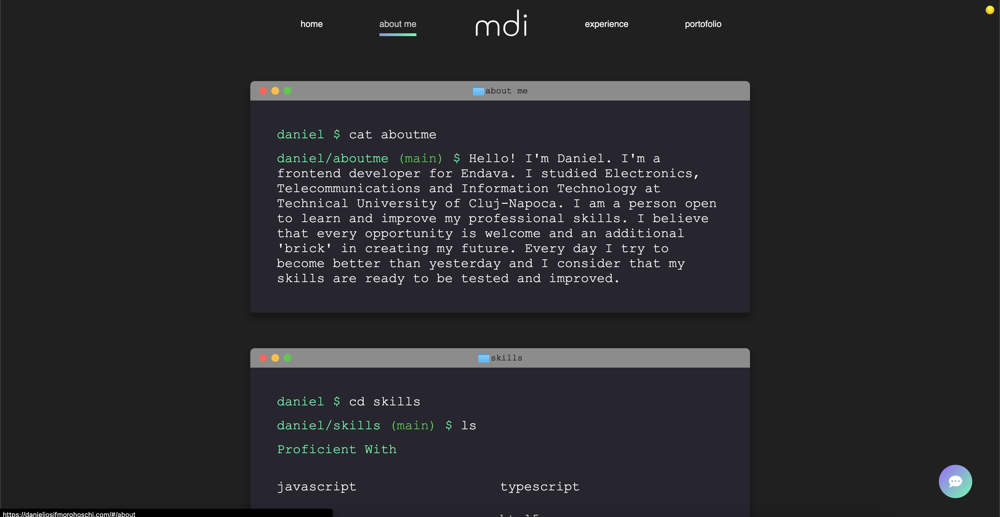
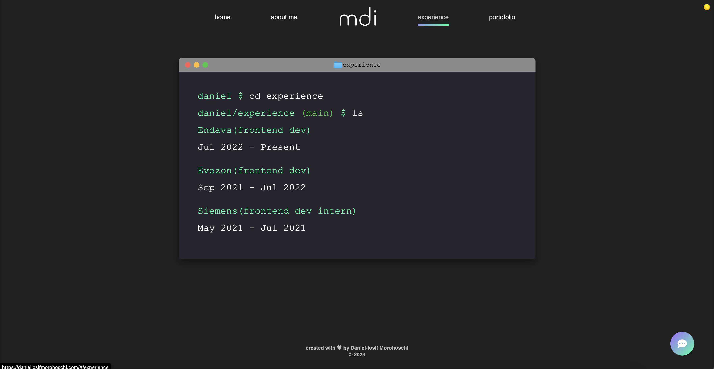
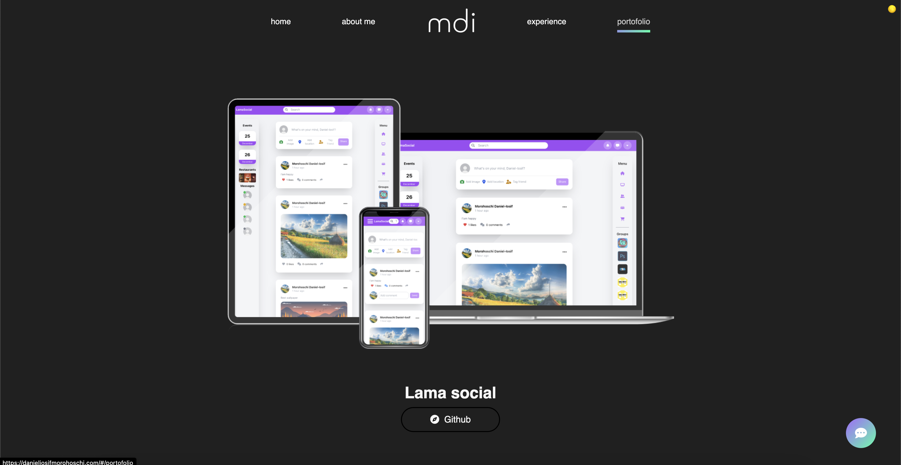
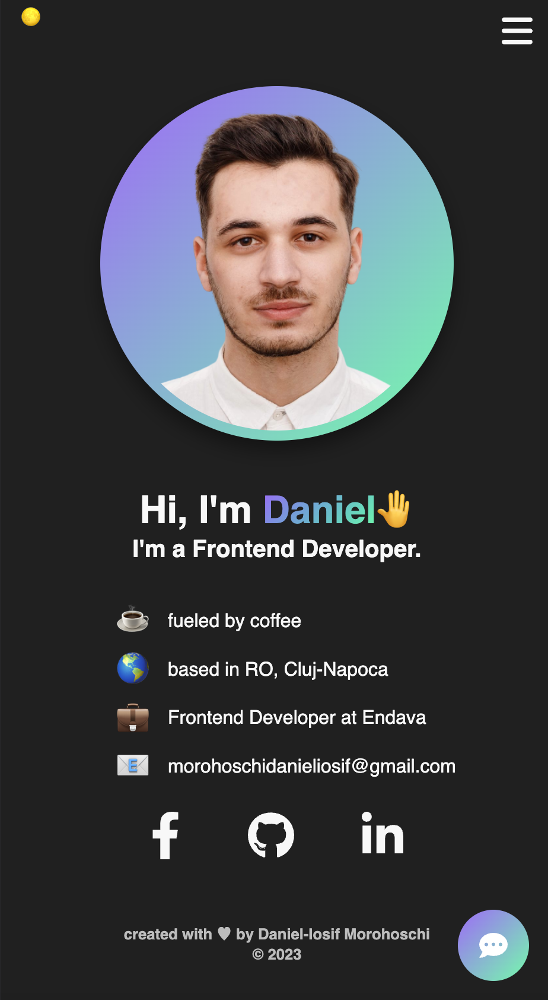
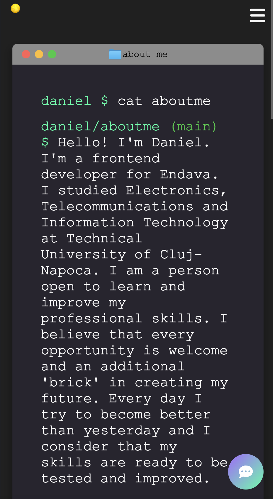
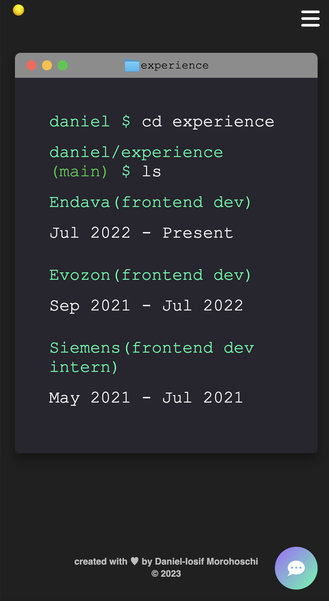
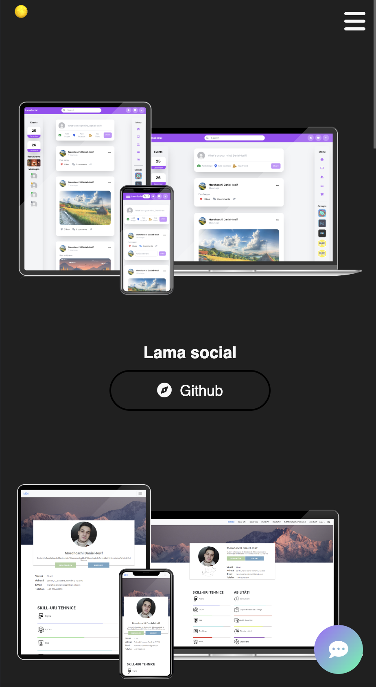

# 🚀 Personal Portfolio 🚀

Welcome to my portfolio page! This repository contains the source code for my personal portfolio website, where I showcase information about myself, the projects I've worked on, and my skills.

## 👨‍💻 About Me

Hello, I'm Daniel-Iosif Morohoschi, and I'm a passionate web developer. With 2 years of industry experience, I have worked with various technologies and frameworks to create innovative web solutions.

## 🔗 View Website

You can view my portfolio website here: https://danieliosifmorohoschi.com/

## 📸 Screenshots

## 🔧 Skills

- javascript
- typescript
- react js
- html5
- css3
- git
- sass
- bootstrap
- material ui
- tailwind css
- json-web-token
- jquery
- java
- nodejs
- mysql
- mongodb
- javaserver pages
- figma
- firebase

## 🌐 Contact

If you'd like to get in touch with me or discuss potential collaborations, you can reach me at morohoschidanieliosif@gmail.com or using my website.
